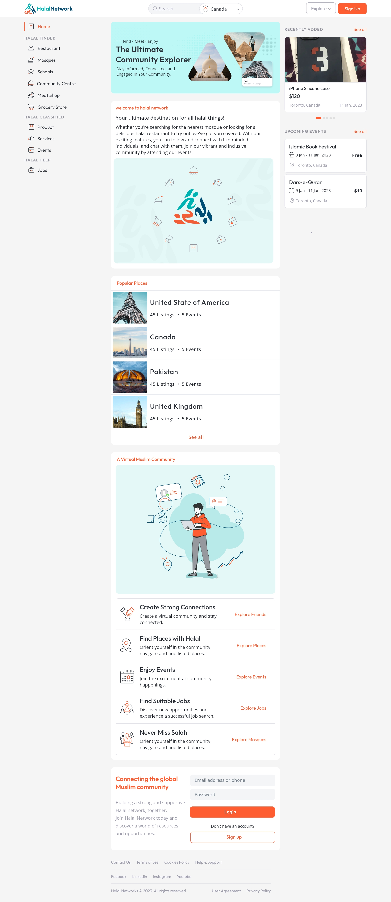

# Halal Network Website Frontend Task

This repository contains the code for the frontend of the **Halal Network** website. The task was given by **[Transviti](https://transviti.com/ "Transviti")** as part of the hiring process for the position of **[Frontend Developer](https://www.google.com/search?q=frontend+developer "Frontend Developer")**.

## Build

##### Deployment

The final build is deployed on **[Vercel](https://vercel.com/ "Vercel")**, a popular cloud hosting platform for static websites and web applications. **[Click here](https://transviti-halal-network.vercel.app/ "Click here")** to have a preview.

##### Technologies

Following are the Frontend Technologies used to build the website:

- **[Next.js](https://nextjs.org/ "Next.js")** is a popular React-based framework for building server-side rendered (SSR) web applications.

- **[Tailwind CSS](https://tailwindcss.com/ "Tailwind CSS")** is a popular CSS framework that provides a set of pre-defined classes for styling web pages.

- **[Daisy UI](https://daisyui.com/ "Daisy UI")** is a popular open-source UI framework for building web applications.

## Requirement Preview

## Contributing

If you would like to contribute to the project, please fork the repository and submit a pull request.

## Contact

If you have any questions or feedback, please feel free to contact me at **[mdazlaan1996@gmail.com](mailto:mdazlaan1996@gmail.com "mdazlaan1996@gmail.com")**.
